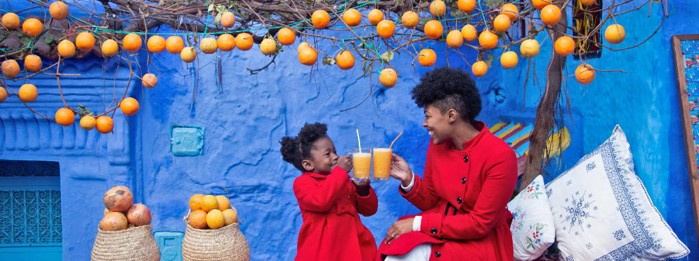

# Tourisme

*Figure: Tourisme*

Chefchaouen, connue sous le surnom de "Perle Bleue", est une destination touristique prisée au Maroc pour sa beauté pittoresque et son ambiance tranquille. Voici quelques-unes des attractions touristiques populaires à Chefchaouen :

- **Les rues bleues :** Chefchaouen est célèbre pour ses rues étroites et ses bâtiments peints dans des nuances de bleu vif, créant une atmosphère unique et charmante. Les visiteurs peuvent se promener dans les ruelles sinueuses, admirer l'architecture traditionnelle et capturer des photos saisissantes.

- **La médina :** La médina de Chefchaouen est un dédale de rues pavées, de souks animés et de places tranquilles. Les voyageurs peuvent explorer les boutiques d'artisanat local, acheter des tapis, des poteries et d'autres produits artisanaux, et déguster des plats délicieux dans les cafés et restaurants de la région.

- **La Kasbah :** La Kasbah de Chefchaouen est une ancienne forteresse qui offre une vue imprenable sur la ville et les montagnes environnantes. Les visiteurs peuvent visiter ses jardins, ses musées et ses expositions d'art, ainsi que profiter de panoramas spectaculaires depuis ses remparts.

- **Les cascades d'Akchour :** Situées à proximité de Chefchaouen, les cascades d'Akchour sont un lieu de randonnée populaire offrant des paysages pittoresques et des piscines naturelles rafraîchissantes. Les voyageurs peuvent faire de la randonnée jusqu'aux cascades, se baigner dans les eaux cristallines et profiter de la nature environnante.

- **Les excursions dans les montagnes du Rif :** Chefchaouen est entourée par les montagnes du Rif, offrant aux visiteurs de nombreuses possibilités d'excursions en pleine nature. Les voyageurs peuvent faire de la randonnée, du VTT, de l'escalade et explorer des villages berbères pittoresques le long du chemin.