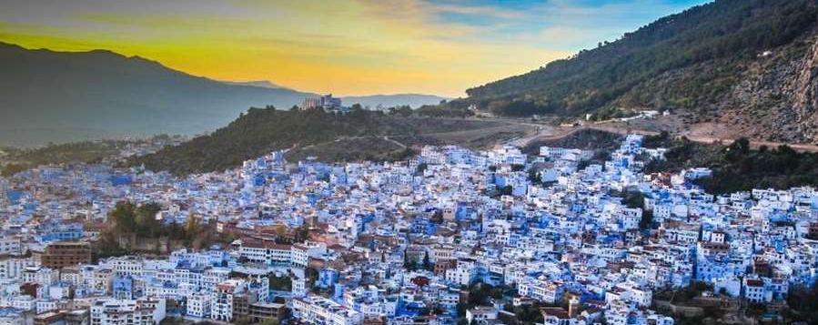

<!-- new slide -->

# Climate

*Figure: Climate*

<!-- note -->
Le climat de Chefchaouen est de type méditerranéen, caractérisé par des étés chauds et secs ainsi que des hivers doux et humides. Voici un aperçu des conditions climatiques typiques à Chefchaouen :

- **Été (juin à août) :** Les étés à Chefchaouen sont chauds et ensoleillés, avec des températures diurnes moyennes atteignant souvent les 30°C. Les nuits peuvent être plus fraîches, mais restent généralement douces. Les précipitations sont rares pendant cette période, et les journées ensoleillées sont idéales pour explorer la ville et ses environs.

- **Automne (septembre à novembre) :** L'automne apporte des températures légèrement plus fraîches à Chefchaouen, avec des journées agréables et des nuits fraîches. Les précipitations commencent à augmenter progressivement à mesure que la saison avance, mais les averses restent généralement légères et sporadiques.

- **Hiver (décembre à février) :** Les hivers à Chefchaouen sont doux et humides, avec des températures diurnes moyennes autour de 15-20°C. Les nuits peuvent être fraîches, mais les températures restent généralement au-dessus de zéro. Les précipitations sont les plus abondantes pendant cette période, avec des averses fréquentes et parfois des périodes prolongées de pluie.

- **Printemps (mars à mai) :** Le printemps est une période agréable à Chefchaouen, avec des températures douces et des journées ensoleillées. Les précipitations diminuent progressivement à mesure que la saison avance, et les paysages environnants commencent à fleurir avec une végétation luxuriante.
