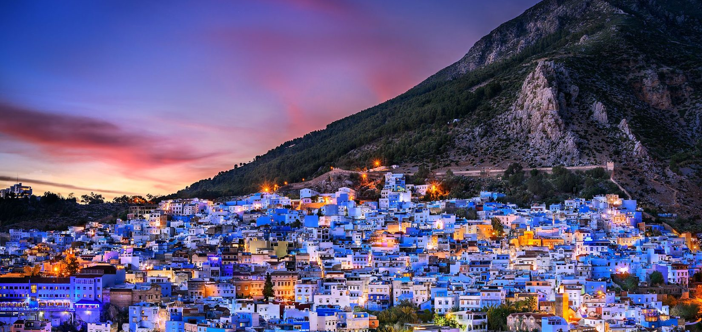

# conclusion

*Figure: conclusion*

Chefchaouen, avec ses rues bleues pittoresques, sa médina animée et ses paysages montagneux spectaculaires, offre une expérience touristique unique au Maroc. Cette ville charmante, surnommée la "Perle Bleue", captive les visiteurs avec son ambiance paisible, son riche patrimoine culturel et ses opportunités d'aventure en plein air. Que ce soit pour se perdre dans les ruelles bleues, explorer les cascades d'Akchour ou simplement se détendre dans les montagnes du Rif, Chefchaouen promet des souvenirs inoubliables et des découvertes fascinantes à chaque coin de rue.
